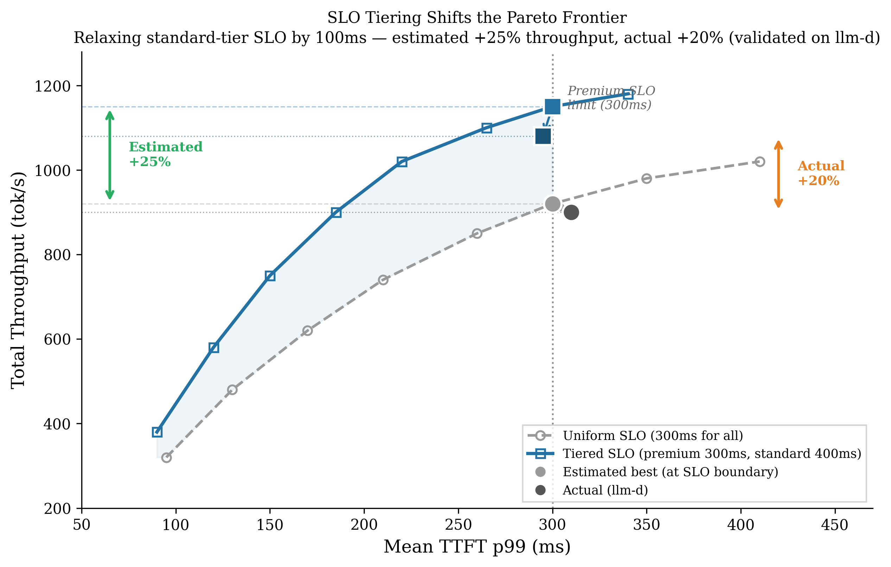

# Config Exploration: Deployment Quality Through Better Recommendations

## Core Thesis

Stack operators face a pre-deployment decision problem: given a model, workload, and SLO contract, what's the cheapest config that actually works? Today they either over-provision (expensive) or discover misconfiguration in production (SLO violations). Existing tools (Vidur, llm-optimizer, aiconfigurator, LLMServing) model only the engine layer — they cannot reason about admission control, priority scheduling, or SLO tiering, which are the mechanisms operators use to manage real traffic.

BLIS models the full serving stack: not just "how fast does one batch run" but "given this mix of traffic priorities and this admission policy, how many requests/second can I sustain at SLO?" This produces recommendations that are cheaper and more realistic because the operator's degrees of freedom extend beyond TP and batch size into how traffic is shaped, prioritized, and shed.

## Section Flow

**Part 1 — Comparative: BLIS vs. other tools on the same task (Charts 1–2).** All tools search the same config space for the same workload. We deploy every tool's recommendation on real llm-d and compare outcomes. BLIS finds cheaper configs that actually meet SLO; other tools over-provision or produce false positives.

**Part 2 — BLIS-only what-if analysis (Charts 3–5).** These explore deployment optimizations that only BLIS can evaluate because other tools don't model the relevant mechanisms. No head-to-head comparison — instead we show what becomes possible when the simulator understands production-level behavior: tiered scheduling unlocks free throughput (Chart 3), accurate capacity modeling delays costly scale-out (Chart 4), and cross-model evaluation identifies viable upgrades (Chart 5). All validated on real llm-d.

---

## Chart 1 — Config Search + Sim2Real Validation

**Question:** What's the cheapest config that meets my SLOs — and will it actually work?

**Setup.** Chatbot workload (Qwen3-14B), SLO: mean TTFT < 300ms. Each tool explores 432 configs and produces an estimated Pareto front. We select each tool's top-3 cheapest SLO-meeting configs and deploy them on real llm-d.

**Presentation.** Throughput vs. TTFT scatter with Pareto fronts per tool (hollow markers). Drift arrows connect estimated → actual positions. Configs that violated SLO in production are flagged red.

**Result.** BLIS recommends single-GPU configs ($1.50–$3.20/hr) with short drift arrows that stay SLO-compliant. Other tools require 2–4 GPUs ($5.60–$6.40/hr) and some cross the SLO line when deployed — dangerous false positives.

---

## Chart 2 — Runtime and Resource Cost

**Question:** How long does config search take, and what resources does it need?

**Result.** BLIS delivers accurate recommendations (Chart 1) in minutes on a CPU. Profiling tools take hours on GPUs — worthwhile only if their predictions hold, which Chart 1 shows they often don't. BLIS also lets operators evaluate hardware they haven't procured yet.

---

## Chart 3 — SLO Tiering: Free Throughput from Priority-Aware Scheduling

**Question:** Can I get more throughput by relaxing SLOs only for users who can tolerate it?

**Setup.** Run config search twice on the same 432-config space: (1) Baseline — uniform SLO (P99 TTFT < 300ms for all), (2) Tiered — premium keeps 300ms, standard relaxed to 400ms. Pick the best SLO-meeting config from each frontier. Deploy both on llm-d.

**Presentation.** Two Pareto frontiers (throughput vs. latency). The tiered frontier dominates the baseline. At the 300ms boundary, filled markers show each frontier's best config; drift arrows show actual performance on llm-d. Brackets compare estimated gain (+25%) vs. actual (+20%).

**Result.** Relaxing standard-tier SLO by 100ms shifts the frontier upward — +20% throughput validated on real hardware, with no premium degradation. The gain is "free": same hardware, same premium SLO, just smarter scheduling. Other tools can't evaluate this because they don't model priority-aware scheduling.

---

## Chart 4 — Scaling Curve: When to Add Capacity

**Question:** When do I need to add GPUs as traffic grows?

**Setup.** Qwen3-14B on H100 ($3.20/hr each), SLO: P99 TTFT < 300ms. Increase target throughput from 200–1600 tok/s. Each tool recommends a config at each level.

**Presentation.** Step-function: target throughput (x) vs. deployment cost (y). Each step = "tool says add a GPU here." Stars = BLIS configs validated on llm-d.

**Result.** BLIS sustains 1000 tok/s on 1xH100 (validated). Other tools recommend a second GPU at 600–800 tok/s — 2x cost for the same traffic because they underestimate single-GPU capacity.

---

## Chart 5 — Model Selection: Serving a Better Model on Existing Hardware

**Question:** Can I serve a larger model on my current hardware?

**Setup.** 1xH100, chatbot workload. SLO: minimum 300 tok/s. Compare tool estimates for Qwen3-7B/14B/32B against ground truth on llm-d.

**Result.** BLIS correctly identifies Qwen3-32B as viable (380 estimated, 350 actual — both above 300 tok/s minimum). Every other tool underestimates by 40–65% and rejects it. Without BLIS, operators either over-provision (2x cost) or settle for a smaller model.
