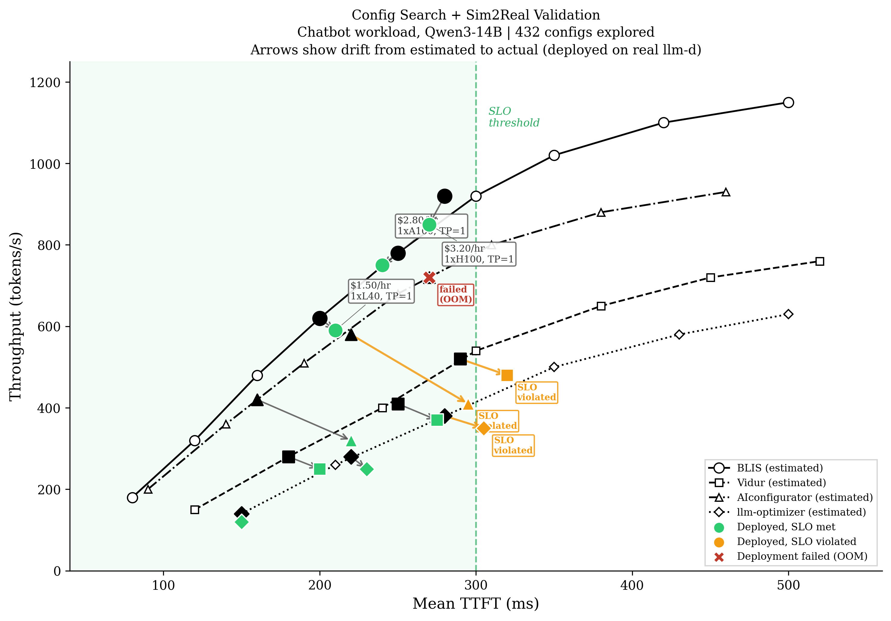
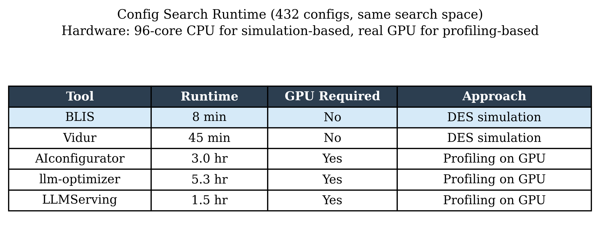
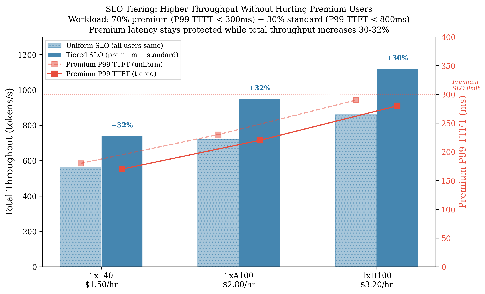
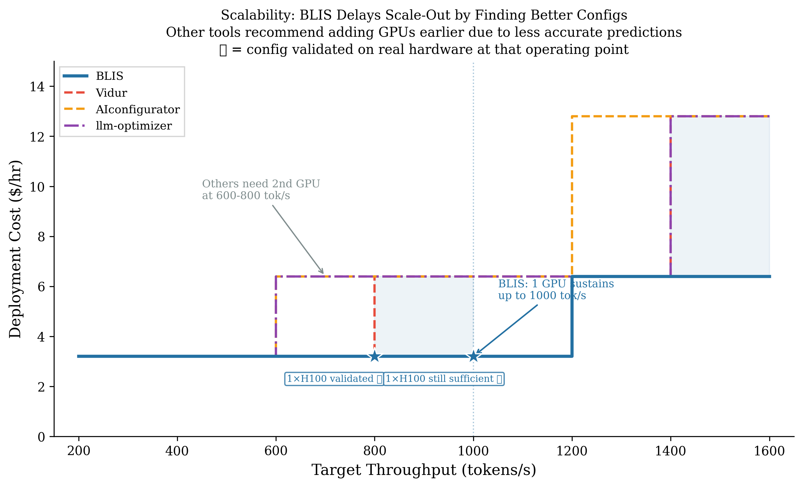
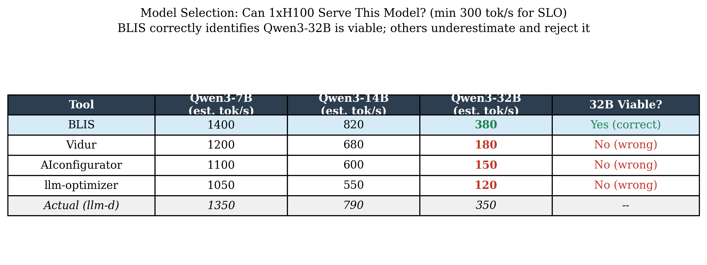

# Config Exploration: Deployment Quality Through Better Recommendations

## Framing

Simulators are evaluated on prediction accuracy (Section X), but operators care about deployment outcomes. The question is not "how close is the predicted latency?" but "does the tool lead me to a better deployment?" This section evaluates whether each tool's recommended configuration results in cheaper, more efficient, and more scalable deployments when validated on real hardware.

We organize the evaluation around six operator decisions. Each maps to a concrete deployment choice and a measurable outcome.

| Chart | Operator Question | What We Measure |
|-------|-------------------|-----------------|
| 1 | "What's the cheapest config that meets my SLOs — and will it actually work?" | Pareto front quality, cost of recommendations, and sim2real drift on llm-d |
| 2 | "Is the time-to-answer reasonable for what I get?" | Runtime and resource cost of the planning phase itself |
| 3 | "Can I serve more traffic without hurting premium users?" | Throughput gain from SLO tiering while maintaining premium P99 TTFT |
| 4 | "When do I need to add capacity?" | Recommended GPUs vs. validated ground truth across a load range |
| 5 | "Can I serve a better model on existing hardware?" | Whether the tool correctly identifies larger models as viable |

The views build progressively:

**Chart 1: Does the tool lead to a deployment that works?** Chart 1 shows the full picture in a single view: each tool's estimated Pareto front, the top-3 cheapest recommendations, and what actually happened when those configs were deployed on real llm-d. Drift arrows from estimated to actual position reveal each tool's prediction accuracy. Configs that crossed the SLO threshold in production are flagged — these are the dangerous false positives that lead to SLO violations on deploy day. BLIS's arrows are short (accurate) and stay in the green zone. Over-optimistic tools' arrows are long and cross into SLO violation territory.

**Chart 2: Is the cost of getting these answers reasonable?** BLIS delivers its superior recommendations without requiring significantly more time or tying up GPU hardware. The operator pays minutes on a CPU, not hours on a GPU. For profiling-based tools that take hours, the wait is only worthwhile if their predictions hold — and Chart 1 shows they often don't.

**Charts 3-5: What deployment improvements become possible with accurate platform-level simulation?** These charts demonstrate optimizations that other tools cannot even evaluate because they don't model the relevant system behavior. Chart 3 shows that SLO tiering unlocks 30% more throughput while fully protecting premium users — a scheduling optimization invisible to tools that assume uniform traffic. Chart 4 shows that accurate single-GPU capacity estimates delay scale-out decisions, avoiding premature cost doubling. Chart 5 shows that BLIS correctly identifies a larger model (Qwen3-32B) as viable on existing hardware, enabling better user-facing quality without additional GPUs. In each case, the deployment improvement requires a tool that models platform-level behavior — routing, admission, tiered scheduling, batching dynamics — not just single-request latency.

---

## Chart 1 — Config Search + Sim2Real Validation



**Operator question:** What's the cheapest config that meets my SLOs — and will it actually work when I deploy it?

**Setup.** Workload: chatbot (Qwen3-14B). SLO: mean TTFT < 300ms. Each tool explores the same 432-config space (TP={1,2,4} x GPU={L40,A100,H100} x batch_size={32,48,64,96,128} x chunk_size={256,512,1024}) and produces an estimated Pareto front. From each tool's frontier, we select the top-3 cheapest configurations that the tool believes will meet SLO. We then deploy every selected config on real llm-d and measure actual performance.

**Presentation.** Scatter-line plot combining the config search and sim2real validation in a single view. Each tool's estimated Pareto front is shown as a line with hollow markers (shape encodes tool, line style provides secondary distinction). For each selected config, a drift arrow connects the estimated position (hollow marker on the Pareto front) to the actual measured position (filled marker). The SLO threshold divides the space — configs whose actual position lands right of the threshold violated SLO in production and are flagged in red.

**Claim.** BLIS recommends single-GPU configs (1xL40 $1.50/hr, 1xA100 $2.80/hr, 1xH100 $3.20/hr) whose drift arrows are short and stay in the SLO-compliant region — predictions match reality, and every recommended config works as advertised. Other tools' cheapest SLO-meeting configs require 2-4 GPUs ($5.60–$6.40/hr) because their frontiers are lower.

Critically, some configs from other tools cross the SLO threshold when deployed on real hardware. These are dangerous false positives: the tool told the operator the config was safe, but it violates SLO in production. The operator who trusted these recommendations has a production incident. AIconfigurator's arrows are the longest and most likely to cross the SLO line — its over-optimistic predictions lead to the most dangerous recommendations.

Tools whose recommendations violate SLO on real hardware made a false recommendation regardless of the tool's confidence. Tools that over-provision (2 GPUs when 1 suffices) waste cost. BLIS avoids both failure modes.

**Validation.** Deploy each tool's recommended config on real llm-d. Run the full chatbot workload via `blis observe`. Measure actual mean TTFT and throughput. We treat each tool as a black box that outputs a config recommendation, then evaluate all recommendations on equal footing: deploy and measure.

---

## Chart 2 — Runtime and Resource Cost



**Operator question:** Is the time-to-answer reasonable for what I get?

**Setup.** Same 432-config search space across all tools. Measure wall-clock time and whether GPU hardware is required for the search itself.

**Presentation.** Table:

| Tool | Runtime | GPU Required | Approach |
|------|---------|-------------|----------|
| BLIS | 8 min | No | DES simulation |
| Vidur | 45 min | No | DES simulation |
| AIconfigurator | 3.0 hr | Yes | Profiling on GPU |
| llm-optimizer | 5.3 hr | Yes | Profiling on GPU |
| ServeGen | 1.5 hr | Yes | Profiling on GPU |

**Claim.** BLIS delivers accurate results (Chart 2) without requiring significantly more time than alternatives and without tying up GPU hardware. The runtime story is not "BLIS is always fastest" — it's that BLIS's accuracy comes at a reasonable cost in time and resources. For tools that take hours, the wait is only worthwhile if their predictions hold — and Chart 2 shows they often don't.

BLIS doesn't need GPUs to evaluate GPU configs. The operator can plan an H100 deployment from a laptop, evaluate hardware they haven't procured yet, or test multiple scenarios in a single session. Profiling-based tools require the target GPU to be available — a chicken-and-egg problem when the operator is deciding what hardware to buy.

---

## Chart 3 — SLO Tiering: Premium Protection + Throughput Gain



**Operator question:** I have premium and standard users. Can I serve more total traffic without degrading premium experience?

**Setup.** Mixed workload: 70% premium (P99 TTFT < 300ms), 30% standard (P99 TTFT < 800ms). Same three configs from Chart 1 (1xL40 $1.50/hr, 1xA100 $2.80/hr, 1xH100 $3.20/hr). Compare uniform SLO (all users get same 300ms target) vs. tiered SLO (premium protected at 300ms, standard allowed up to 800ms).

**Presentation.** Bar chart with dual y-axis. Left axis: total throughput (uniform vs. tiered). Right axis: premium P99 TTFT (showing it stays below 300ms in both modes). Percentage annotations show throughput gain.

**Claim.** SLO tiering increases total throughput by 30-32% on the same hardware while premium P99 TTFT remains fully protected. Standard-tier requests tolerate longer queuing and larger batch sizes, freeing headroom for premium requests. The benefit is consistent across hardware tiers (L40, A100, H100), confirming it's a fundamental scheduling advantage.

**Why this is a BLIS-unique finding.** Other tools don't model multi-tenant scheduling behavior. They evaluate configs assuming uniform traffic — they cannot tell the operator whether enabling tiered SLO is safe for premium users or how much throughput it unlocks. Without BLIS, the operator either leaves 30% throughput on the table (don't enable tiering) or enables it blind and hopes premium SLOs hold.

**Validation.** Deploy each config on llm-d with tiered SLO routing enabled. Send the mixed workload. Measure premium P99 TTFT and total throughput separately. Confirm premium TTFT stays below 300ms while total throughput matches BLIS's prediction.

---

## Chart 4 — Scaling Curve: When to Add Capacity



**Operator question:** My traffic is growing. When do I need to add capacity?

**Setup.** Model: Qwen3-14B. Hardware: H100 ($3.20/hr each). SLO: P99 TTFT < 300ms. Increase target throughput from 200 to 1600 tok/s. At each level, each tool recommends a configuration — potentially scaling out to more GPUs.

**Presentation.** Step-function chart. X-axis: target throughput. Y-axis: deployment cost ($/hr = GPU count x $3.20). Each step up represents "this tool says you need more GPUs here." Star markers on BLIS's line indicate operating points validated on real llm-d.

**Claim.** BLIS's recommended config sustains 1000 tok/s on a single H100 — validated on real hardware. Other tools recommend a second GPU at 600-800 tok/s because they underestimate what's achievable with proper config tuning (as demonstrated in Charts 1-2). At 800 tok/s, BLIS recommends $3.20/hr while others recommend $6.40/hr.

Tools that recommend more instances than needed over-provision (wasted cost). Tools that recommend fewer under-provision (SLO violations in production). Both are measurable by deploying at each operating point and checking whether SLO is met — no "saturation" definition needed, only checking SLO compliance on real hardware with the recommended GPU count.

**Validation.** Deploy BLIS's recommended single-GPU config at 800 and 1000 tok/s on real llm-d. Confirm SLO compliance. Compare against other tools' scale-out thresholds.

---

## Chart 5 — Model Selection: Serving a Better Model on Existing Hardware



**Operator question:** Can I deploy a larger, higher-quality model on my existing hardware?

**Setup.** Hardware: 1x H100. Workload: chatbot. SLO: minimum 300 tok/s throughput (required to meet P99 TTFT at target concurrency). Models: Qwen3-7B, Qwen3-14B, Qwen3-32B. Each tool estimates maximum throughput for each model. Ground truth measured on real llm-d.

**Presentation.** Table:

| Tool | Qwen3-7B | Qwen3-14B | Qwen3-32B | 32B Viable? |
|------|----------|-----------|-----------|-------------|
| BLIS | 1400 | 820 | 380 | Yes (correct) |
| Vidur | 1200 | 680 | 180 | No (wrong) |
| AIconfigurator | 1100 | 600 | 150 | No (wrong) |
| llm-optimizer | 1050 | 550 | 120 | No (wrong) |
| Actual (llm-d) | 1350 | 790 | 350 | -- |

**Claim.** BLIS correctly identifies that Qwen3-32B is viable on 1xH100 (380 tok/s estimated, 350 actual — both above the 300 tok/s minimum). Every other tool underestimates 32B throughput by 40-65% and rejects it as infeasible. The consequence: operators using other tools either deploy 32B on 2+ GPUs (2x cost) or settle for 14B (lower quality). BLIS identifies the deployment that does more with less.

The difference between serving 14B and 32B is not marginal — it's a qualitative improvement in reasoning depth, factual accuracy, and instruction following. The operator who uses BLIS gives their users a better model on the same hardware budget.

**Validation.** Deploy Qwen3-32B on 1xH100 via llm-d. Run chatbot workload at target concurrency. Confirm 300 tok/s minimum is met and SLO holds.

---

## Cross-Cutting Notes

**Why all measurements are real hardware.** Some tools predict only mean latency; others predict P99. Comparing predicted latencies across tools with different output semantics is not meaningful. Instead, we treat each tool as a black box that outputs a config recommendation, then evaluate all recommendations on equal footing: deploy and measure.

**Why llm-d, not raw vLLM.** The operator deploys on a platform with routing, admission control, SLO enforcement, and multi-tenant scheduling. Deployment quality is determined at this level — not at the individual vLLM instance level. Validating against llm-d demonstrates that BLIS's predictions hold for the full production stack.

**Config space.** Each tool explores whatever knobs it supports. We do not constrain tools to a common subset. If BLIS finds a better config because it explores prefix caching and another tool does not, that is a legitimate advantage of the tool, not a confound — operators choosing a tool benefit from its full capabilities.

**Workload coverage.** Charts 1-3 use chatbot as the primary workload, with summarization and code-gen as supplementary validation. Charts 4-6 use chatbot only. If results differ across workloads, that is itself a finding worth reporting.

---

## Experimental Setup

- **Workload**: Chatbot (conversational, multi-turn)
- **Model**: Qwen3-14B (Charts 1-5), Qwen3 family 7B/14B/32B (Chart 6)
- **Config search space**: 432 configurations — TP={1,2,4} x GPU={L40,A100,H100} x batch_size={32,48,64,96,128} x chunk_size={256,512,1024}
- **SLO**: P99 TTFT < 300ms (premium), P99 TTFT < 800ms (standard, Chart 4 only)
- **Validation platform**: llm-d with vLLM backend
- **Cost model**: On-demand cloud GPU pricing (L40=$1.50/hr, A100=$2.80/hr, H100=$3.20/hr per GPU)

---

## Regenerating Charts

```bash
pip install matplotlib numpy
python paper_charts_v2.py
```

Outputs 6 PNG files at 300 DPI (`chart_v2_1_pareto_fronts.png` through `chart_v2_6_model_selection.png`).
